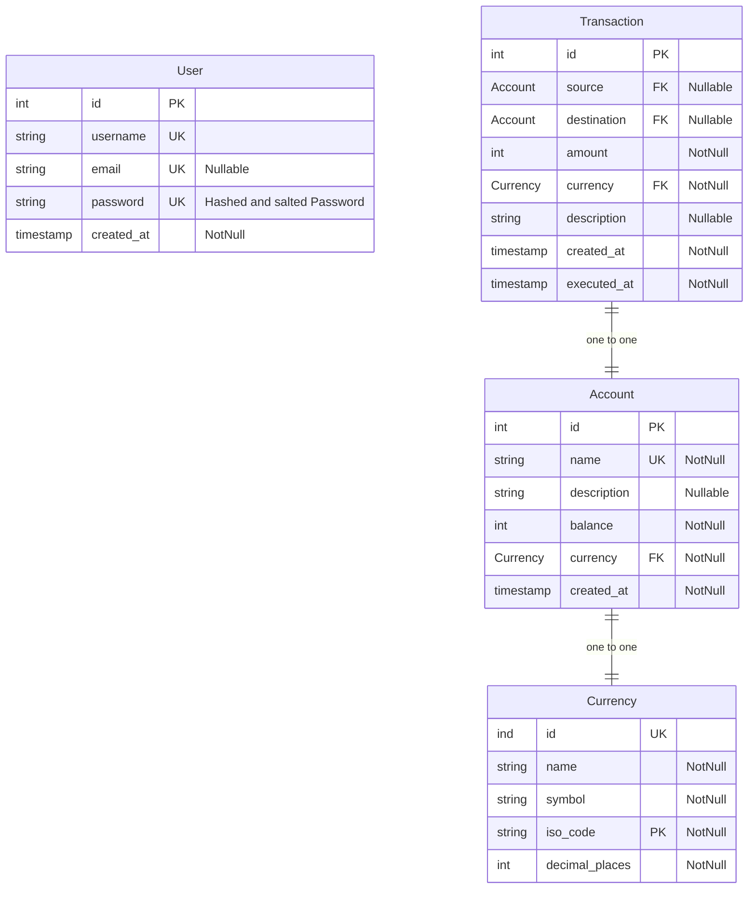

# Database

## Model

```mermaid

erDiagram
	User {
		int id PK
		string username UK
		string email UK "Nullable"
		string password UK "Hashed and salted Password"
		timestamp created_at "NotNull"
	}

	Currency {
		ind id UK
		string name "NotNull"
		string symbol "NotNull"
		string iso_code PK "NotNull"
		int decimal_places "NotNull"
	}
	
	Account {
		int id PK
		string name UK "NotNull"
		string description "Nullable"
		int balance "NotNull"
		Currency currency FK "NotNull"
		timestamp created_at "NotNull"
	}
	Account ||--|| Currency : "one to one"
	
	Transaction {
		int id PK
		Account source FK "Nullable"
		Account destination FK "Nullable"
		int amount "NotNull"
		Currency currency FK "NotNull"
		string description "Nullable"
		timestamp created_at "NotNull"
		timestamp executed_at "NotNull"
	}
	Transaction ||--|| Account : "one to one"
```
