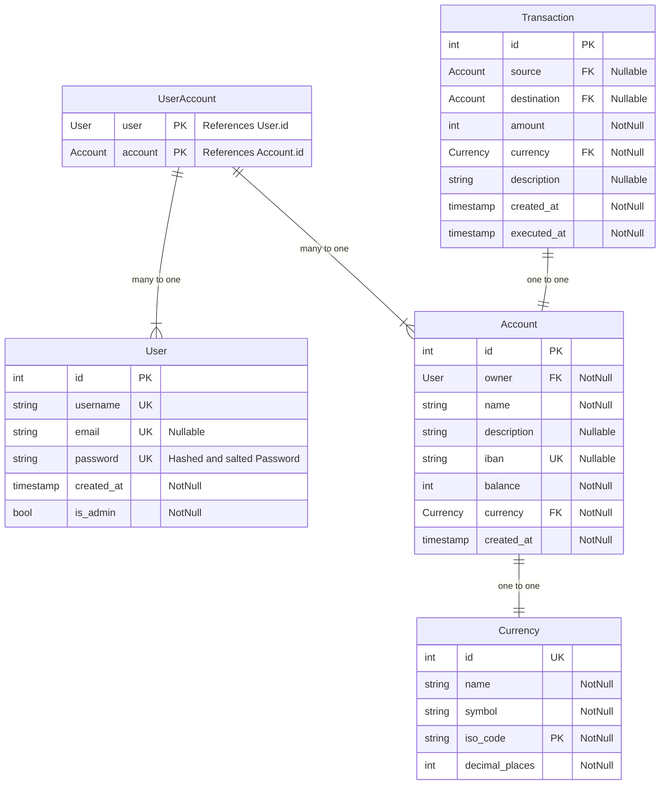

# Database

## Model

```mermaid

erDiagram
	Currency {
		int id UK
		string name "NotNull"
		string symbol "NotNull"
		string iso_code PK "NotNull"
		int decimal_places "NotNull"
	}

	User {
		int id PK
		string username UK
		string email UK "Nullable"
		string password UK "Hashed and salted Password"
		timestamp created_at "NotNull"
		bool is_admin "NotNull"
	}

	Account {
		int id PK
		User owner FK "NotNull"
		string name "NotNull"
		string description "Nullable"
		string iban UK "Nullable"
		int balance "NotNull"
		Currency currency FK "NotNull"
		timestamp created_at "NotNull"
	}
	Account ||--|| Currency: "one to one"

	UserAccount {
		User user PK "References User.id"
		Account account PK "References Account.id"
	}
	UserAccount ||--|{ User: "many to one"
	UserAccount ||--|{ Account: "many to one"

	Transaction {
		int id PK
		Account source FK "Nullable"
		Account destination FK "Nullable"
		int amount "NotNull"
		Currency currency FK "NotNull"
		string description "Nullable"
		timestamp created_at "NotNull"
		timestamp executed_at "NotNull"
	}
	Transaction ||--|| Account: "one to one"
```
## SQL

You can find the SQL script [here](./schema.sql).
