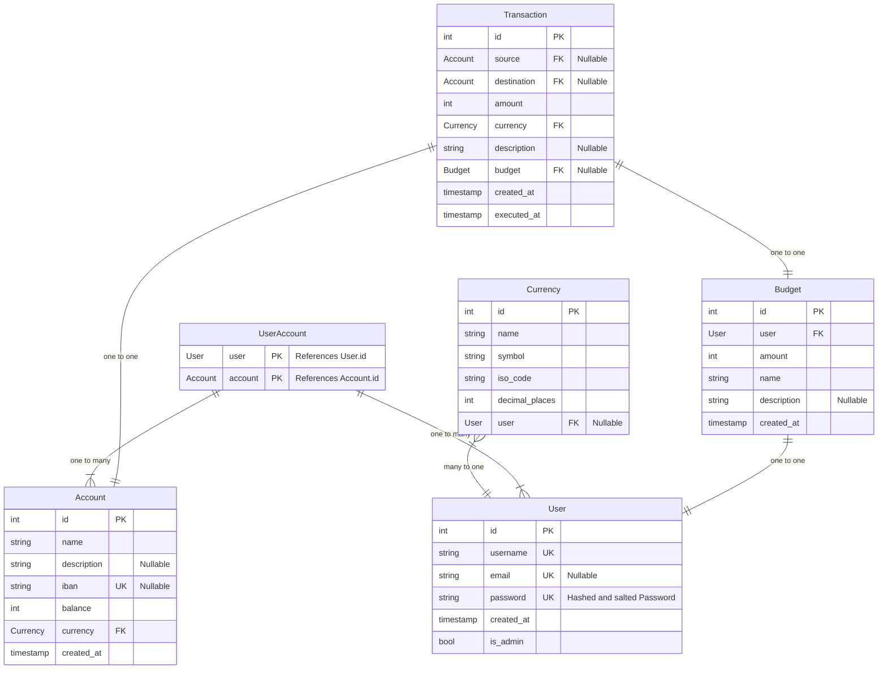

# Database

## Model

```mermaid

erDiagram
    User {
        int id PK
        string username UK
        string email UK "Nullable"
        string password UK "Hashed and salted Password"
        timestamp created_at
        bool is_admin
    }

    Currency {
        int id PK
        string name
        string symbol
        string iso_code
        int decimal_places
        User user FK "Nullable"
    }
    Currency }|--|| User: "many to one"

    Account {
        int id PK
        string name
        string description "Nullable"
        string iban UK "Nullable"
        int balance
        Currency currency FK
        timestamp created_at
    }

    UserAccount {
        User user PK "References User.id"
        Account account PK "References Account.id"
    }
    UserAccount ||--|{ User: "one to many"
    UserAccount ||--|{ Account: "one to many"

    Transaction {
        int id PK
        Account source FK "Nullable"
        Account destination FK "Nullable"
        int amount
        Currency currency FK
        string description "Nullable"
        Budget budget FK "Nullable"
        timestamp created_at
        timestamp executed_at
    }
    Transaction ||--|| Account: "one to one"
    Transaction ||--|| Budget: "one to one"

    Budget {
        int id PK
        User user FK
        int amount
        string name
        string description "Nullable"
        timestamp created_at
    }
    Budget ||--|| User: "one to one" 
```

## SQL

You can find the SQL script [here](https://github.com/financrr/backend/blob/main/entity/src/utility/schema.sql).
